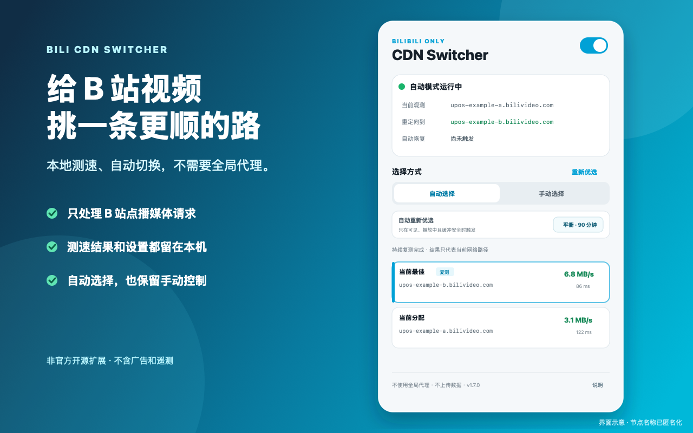

<p align="center">
  
</p>

# Bili CDN Switcher / B站视频 CDN 优选器

[](https://github.com/liiliiliil/bili-cdn-switcher/actions/workflows/ci.yml)
[](LICENSE)
[](manifest.json)

我做这个扩展的原因很简单：人在海外时，明明其他网站都挺快，B 站视频却偶尔卡得让人怀疑人生。

Bili CDN Switcher 会在当前视频可用的 `bilivideo.com` 地址中做一轮本地测速，再为这个播放标签页选择更合适的 CDN。它不需要全局代理，不会接管其他网站，测速结果也不会上传。



当前版本：**v1.7.0**。Chrome Web Store 版本和正式 Release 仍在准备中，目前需要用开发者模式安装。

## 安装

1. 在 GitHub 仓库右上角点击 **Code → Download ZIP**，然后解压。
2. 打开 `chrome://extensions`；Edge 用户打开 `edge://extensions`。
3. 开启“开发者模式”，点击“加载已解压的扩展程序”。
4. 选择包含 `manifest.json` 的文件夹，建议顺手把扩展固定到工具栏。

## 使用

1. 打开一个 B 站视频并播放几秒。
2. 点击扩展图标，确认右上角开关已开启。
3. 保持“自动选择”即可；也可以切到手动模式指定候选节点。

弹窗里出现“当前观测”、候选测速结果和“重定向到”的节点，就说明扩展已经开始工作。重新加载扩展后，记得刷新原来的视频页。

### 自动重新优选

| 档位 | 开始按需复测 | 结果硬过期 | 适合 |
| --- | ---: | ---: | --- |
| 积极 | 30 分钟 | 1 小时 | 网络路径变化较快 |
| 平衡（默认） | 90 分钟 | 2 小时 | 大多数情况 |
| 低频 | 6 小时 | 12 小时 | 路径比较稳定 |

复测只会在可见的视频页正在播放、确实有媒体请求且缓冲充足时发生。只开着首页、动态页、直播页或暂停的视频，不会在后台偷偷测速。

## 它会做什么

- 识别当前视频实际签发和使用的媒体 CDN。
- 先快速初筛，再持续复测较快的候选。
- 自动选择结果最好的节点，也支持手动切换。
- 播放持续卡住时，在自动模式下尝试下一个可用候选。
- 给每个播放标签页建立独立的临时规则；关闭标签页或停用扩展后失效。
- 在本机记住近期遇到的有效 host，同时让长期失败的候选自然退出。

## 权限与隐私

| 权限 | 用途 |
| --- | --- |
| `declarativeNetRequestWithHostAccess` | 为当前播放标签页建立受限的 CDN host 替换规则 |
| `webRequest` | 只读观察 B 站媒体请求及其完成状态 |
| `storage` | 在本机保存开关、候选 host 和有上限的测速摘要 |
| `activeTab` | 点击弹窗时判断当前标签页是否受支持 |
| `bilibili.com` / `bilivideo.com` | 仅覆盖支持的点播页与 B 站媒体 CDN |

扩展没有 `proxy`、Cookie、历史记录或 `<all_urls>` 权限，也不包含遥测、广告、远程代码或开发者服务器。完整说明见 [PRIVACY.md](PRIVACY.md)。

## 已知限制

- 它不是 VPN，不能绕过地区版权、登录限制或失效的媒体签名。
- 当前只处理 `bilivideo.com` 点播媒体，不处理直播、`akamaized.net`、`bilivideo.cn` 或非 B 站请求。
- 部分版权内容或运营商节点会把签名绑定到特定 host，因而无法互换。
- CDN 缓存和跨境路由会变化；这个视频此刻最快的节点，不保证一直最快。
- 已经开始的单个请求不能半途换线。卡顿恢复时可能轻微回退播放位置。
- 如果所有节点的持续带宽都不够，降低清晰度通常比继续换 host 更有效。

## 工作原理

扩展只读观察当前视频的媒体地址，在播放页本地测速，然后通过 Manifest V3 的标签页会话规则替换后续请求的 scheme/host。原路径、查询参数和签名保持不变。

候选来源、测速上限、自动恢复、防抖和规则边界都写在 [工作原理与安全边界](docs/architecture.md)；确认版本、规则和测速状态的方法见 [排障指南](docs/troubleshooting.md)。

## 文档与测试

- [浏览器实测报告](docs/testing/browser-test-report-2026-07-23.md)
- [B站“4K”画质研究](docs/research/bilibili-4k-quality-2026-07-23.md)
- [Chrome Web Store 发布准备](docs/release/README.md)
- [文档索引与公开信息边界](docs/README.md)

公开测试材料已匿名化，不包含测试视频、账号或完整媒体 URL。

## 开发

需要 Node.js 18 或更新版本。项目没有打包构建步骤，源码就是扩展本体。

```bash
npm test
npm run check
```

有问题或想法可以开 [Issue](https://github.com/liiliiliil/bili-cdn-switcher/issues)。参与开发前请看 [CONTRIBUTING.md](CONTRIBUTING.md)；安全问题请按 [SECURITY.md](SECURITY.md) 提交。

## 项目说明

这是一个非官方开源项目，与哔哩哔哩不存在隶属、授权或背书关系。“哔哩哔哩”“Bilibili”等名称与标识的权利归其各自权利人所有。

实现过程中参考了 [Bilibili Video CDN Switcher](https://greasyfork.org/en/scripts/500213-bilibili-video-cdn-switcher)、[BiliCDN Pilot](https://github.com/zzvsjs1/BiliCDN-Pilot)、[Bilibili Accelerator](https://github.com/realzza/bilibili-accelerator) 和 [Bilibili-Evolved](https://github.com/the1812/Bilibili-Evolved)。本项目为独立实现，采用 [MIT License](LICENSE)。
